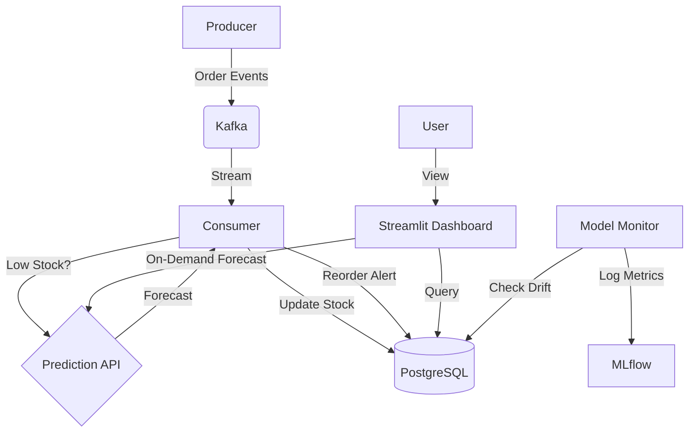

# 🍎 Intelligent Real-Time Grocery Inventory System


An enterprise-grade **Real-Time Inventory Management System** powered by **Event-Driven Architecture** and **Machine Learning**. This project demonstrates a complete MLOps lifecycle: from data ingestion to real-time inference and drift detection.

---

## 📖 Table of Contents
- [✨ Key Features](#-key-features)
- [🏗️ System Architecture](#-system-architecture)
- [🛠️ Technology Stack](#-technology-stack)
- [🚀 Getting Started](#-getting-started)
- [📊 Dashboard & API](#-dashboard--api)
- [🧠 MLOps Approach](#-mlops-approach)
- [📂 Project Structure](#-project-structure)

---

## ✨ Key Features

*   **⚡ Real-Time Ingestion**: Processes order streams instantly using **Apache Kafka**.
*   **🤖 AI-Powered Forecasting**: Predicts 7-day demand using **Prophet** models served via **FastAPI**.
*   **🔔 Intelligent Alerts**: Automatically triggers reorder recommendations when stock is low AND predicted demand is high.
*   **📉 Drift Detection**: Monitors model performance daily to ensure accuracy (`ml/model_monitoring.py`).
*   **📊 Live Dashboard**: Interactive **Streamlit** UI for monitoring stock, forecasts, and model metrics.
*   **⚖️ Scalable Infrastructure**: Fully containerized with **Docker Compose** for easy deployment.

---

## 🏗️ System Architecture

The system follows a reactive, event-driven pattern:



---

## 🛠️ Technology Stack

| Domain | Technology | Purpose |
| :--- | :--- | :--- |
| **Streaming** | Apache Kafka & Zookeeper | High-throughput event backbone. |
| **Database** | PostgreSQL 13 | Relational storage for inventory and ML metadata. |
| **ML Engine** | Prophet & Scikit-Learn | Time-series forecasting and metrics. |
| **API** | FastAPI | High-performance async API for serving models. |
| **Frontend** | Streamlit & Plotly | Real-time interactive dashboard. |
| **MLOps** | MLflow | Experiment tracking and model registry. |
| **DevOps** | Docker & Docker Compose | Container orchestration. |

---

## 🚀 Getting Started

### Prerequisites
*   Docker Desktop installed and running.

### Installation

1.  **Clone the repository**:
    ```bash
    git clone https://github.com/yourusername/grocery-inventory-ml.git
    cd grocery-inventory-ml
    ```

2.  **Start the Application**:
    Run the following command to build and start all 8 services:
    ```bash
    docker-compose up --build -d
    ```

3.  **Verify Status**:
    ```bash
    docker-compose ps
    ```

---

## 📊 Dashboard & API

### 🖥️ Streamlit Dashboard
**URL**: [http://localhost:8501](http://localhost:8501)

*   **Real-Time Stock**: Watch inventory bars animate as orders come in.
*   **Smart Alerts**: Approve or dismiss AI-generated reorder recommendations.
*   **Forecasting**: Select any product to see its 7-day predicted demand curve.

### 🔮 Prediction API
**URL**: [http://localhost:8000/docs](http://localhost:8000/docs) (Swagger UI)

*   **POST /forecast**: Get demand predictions.
    ```json
    {
      "product_name": "Basmati Rice",
      "days": 7
    }
    ```

### 🧪 MLflow UI
**URL**: [http://localhost:5000](http://localhost:5000)

*   Track training runs, parameters, and model versions.

---

## 🧠 MLOps Approach

We don't just train once; we manage the lifecycle:

1.  **Feature Store**: `ml/feature_engineering.py` creates sliding window features from raw SQL data.
2.  **Continuous Training**: `ml/train_model.py` can be triggered to retrain models on new data.
3.  **Model Monitoring**: `ml/model_monitoring.py` runs as a sidebar service, calculating MAE/RMSE daily. If performance drops by >30% (Drift), it logs a retraining trigger.

---

## 📂 Project Structure

For a detailed code walkthrough, see [CODE_EXPLAINED.md](./CODE_EXPLAINED.md).

```bash
ETL-pipeline/
├── api/               # FastAPI Prediction Service
├── consumer/          # Kafka Consumer (Worker)
├── dashboard/         # Streamlit UI
├── db/                # SQL Schemas & Seeds
├── ml/                # Feature Eng, Training, Monitoring
├── models/            # Serialized .pkl models
├── producer/          # Data Simulator
└── docker-compose.yml # Infrastructure Definition
```

---

## 📜 License

This project is licensed under the MIT License - see the LICENSE file for details.
